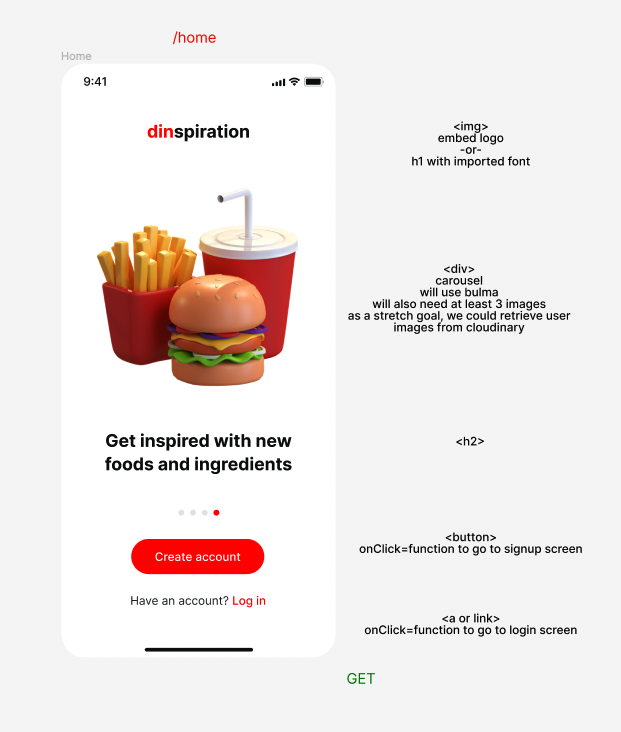
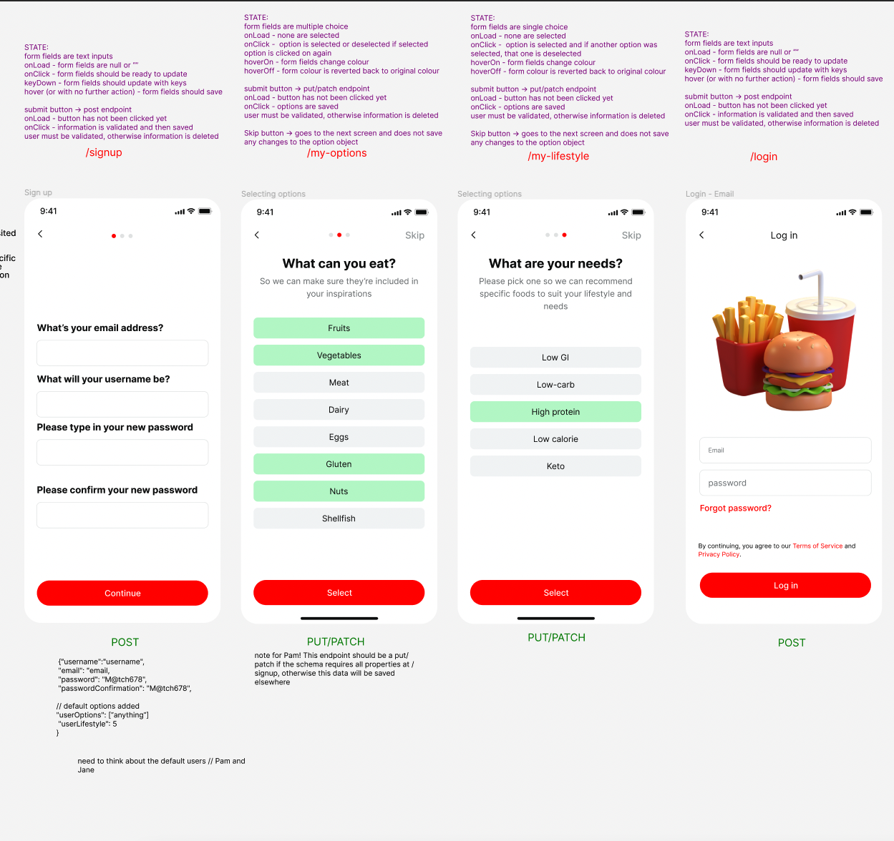
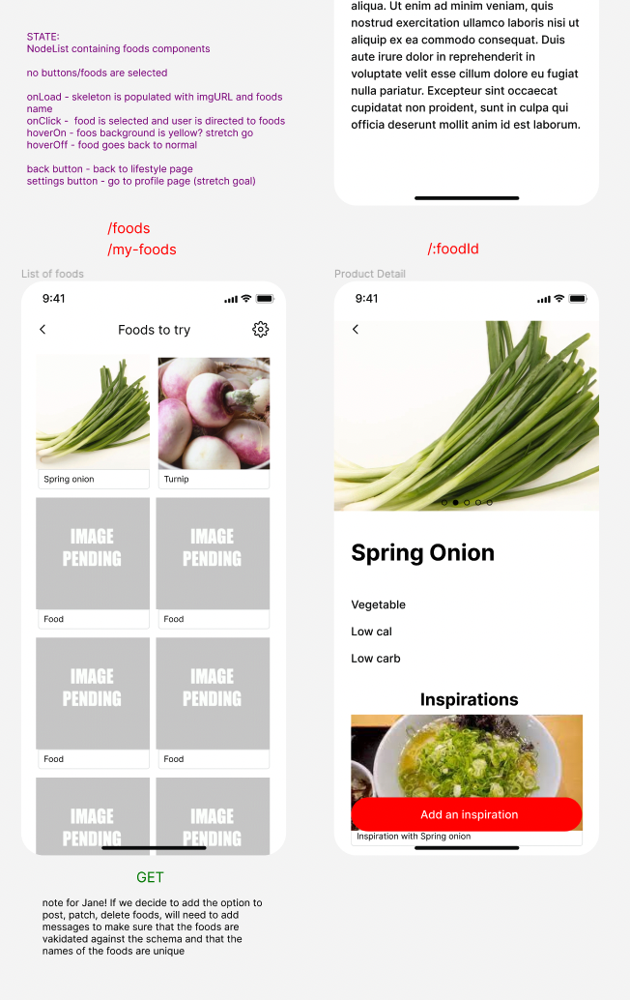
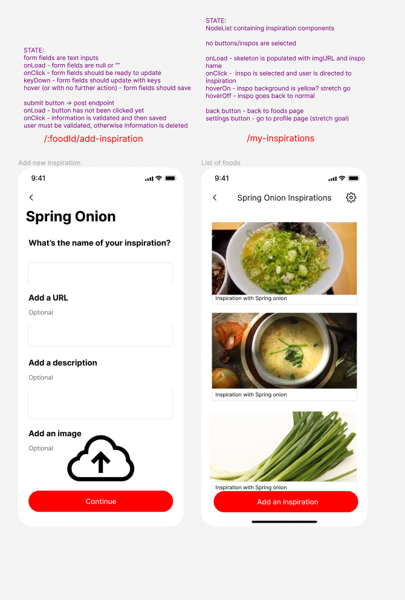
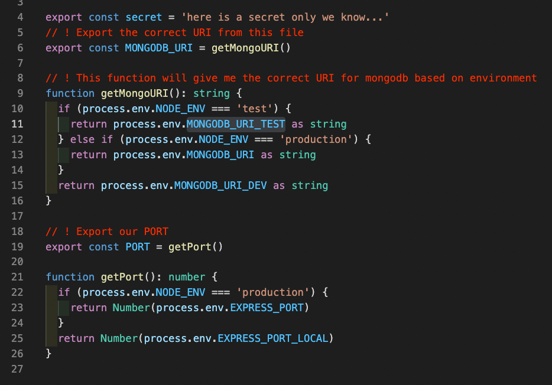

#  Dinspiration 

* An app for foodies who want to try out new ingredients and inspire one another with original recipe ideas.  

* We built a MERN app in which a user can sign up, login, provide their dining preferences and be presented with interesting new foods ideas and user-generated recipe suggestions, as well as adding their own.

## Deployment Link

* Try out the app at https://dinspiration.netlify.app

* Sign up or login with dummy login below: 

  email: bob@dot.com
  password: 123qwe!@£QWE

## Getting Started

### Backend

https://github.com/shkendi/dinspiration-backend

1. clone repo Dinspiration-Backend
2. open Dinspiration-Backend in your code editor 
3. cd into the root directory and run 'npm i' in terminal to install the dependencies
4. run 'npm run seed' in the terminal to add the seed data for your demo
5. run 'npm run build' in the terminal to build the JavaScript in the dist folder
6. run 'npm run dev' in the terminal to run the program

### Frontend

git@github.com:PamelaOnGit/dinspiration-frontend.git

1. clone repo Dinspiration-Frontend
2. open Dinspiration-Frontend in your code editor
3. cd into the root directory
4. run 'npm i' to install the dependencies
5. run 'npm run build' to build the JavaScript files in the dist
6. run 'npm run dev' to run the program 
7. Preview the index.ts in the browser

## Timeframe & Working Team

* We agreed that Pam would take the lead on the user flow, Jane on the foods, and me on the recipes (which we called “inspirations”). We all contributed to the planning with ideas and logic and agreed that Jane would configure it using Figma. Planning was done mainly on the first day, added a few more details the day after, and then we jumped straight into the coding stage.
We used Figma to create a mock-up of how the app would function. We worked up a flow, as follows:

* The main project was completed over 10 days, but I have since made some additions and modifications. 

## Technologies Used

* MongoDB
* Express
* React
* Node
* Bulma
* bcrypt
* JsonWebToken
* Jest and Supertest

## Brief

### Technical Requirements

* Work in a team, using **git to code collaboratively**
* **Build a full-stack application** by making your own backend and your own front-end
* **Use an Express API** to serve your data from a Mongo database
* **Consume your API with a separate front-end** built with React
* **Be a complete product** which most likely means multiple relationships and CRUD functionality for at least a couple of models
* **Implement thoughtful user stories/wireframes** that are significant enough to help you know which features are core MVP and which you can cut
* **Have a visually impressive design** to kick your portfolio up a notch and have something to wow future clients & employers **ALLOW** time for this
* **Be deployed online** so it's publicly accessible
* **Have automated tests** for _at least_ one RESTful resource on the back-end. Improve your employability by demonstrating a good understanding of testing principals

### Necessary Deliverables

* A **working app** hosted on the internet
* A **link to your hosted working app** in the URL section of your Github repo
* A **git repository hosted on Github**, with a link to your hosted project, and frequent commits dating back to the _very beginning_ of the project
* **A `readme.md` file** with:
    * An embedded screenshot of the app
    * Explanations of the **technologies** used
    * A couple paragraphs about the **general approach you took**
    * **Installation instructions** for any dependencies
    * Link to your **user stories/wireframes** – sketches of major views / interfaces in your application
    * Link to your **pitch deck/presentation** – documentation of your wireframes, user stories, and proposed architecture
    * Descriptions of any **unsolved problems** or **major hurdles** you had to overcome

## Planning

### User Stories - Jira

We agreed on a food app - when we are busy with work, family and friends, meals can become a chore and we can end up eating the same things every day.  We all liked the idea of an app that allows users to inspire one another with fun and interesting suggestions.  

I started by writing some [user stories](stories.md) for the basic app. 

### Flow - Figma

We chose the working title, 'Dinspiration' and used Figma to create a mock-up of how the app would function.  We worked up a flow, as follows:

#### Home Screen

#### Signup and Login

After login, the user is invited to provide some information about the sort of food she might try: 

#### My Foods, Food Screen and Recipes
The user is then presented with a selection of slightly unusual ingredients to try out.  Clicking on a particular food takes the user to a screen with more information about the chosen food and, below it, a selection of user-generated recipes and serving suggestions:  
 

#### Add Recipe

The user can share her own recipe or serving suggestion, along with a photo of her creation.

## Build

### Setup

1. We set up a Jira project and divided the project into stages: planning and setup, backend-setup, backend development, frontend-setup, frontend development, testing.

2. We agreed that Pam would take the lead on the user flow, Jane on the foods and I on the recipes (which we called, inspirations).  

#### Models

#### Testing

1. I used Jest and Supertest to add end-to-end testing to the backend. This was my first attempt to configure end-to-end testing on my own.  I started by installing Jest and Supertest and writing some simple tests in the users.test.ts file.  

2. I created a separate testing environment with a separate database for the purpose of testing.  I created the .env file and an environment file containing a function that can vary the URI and port depending on whether process.env.NODE_ENV is equal to 'test' or 'production': 

